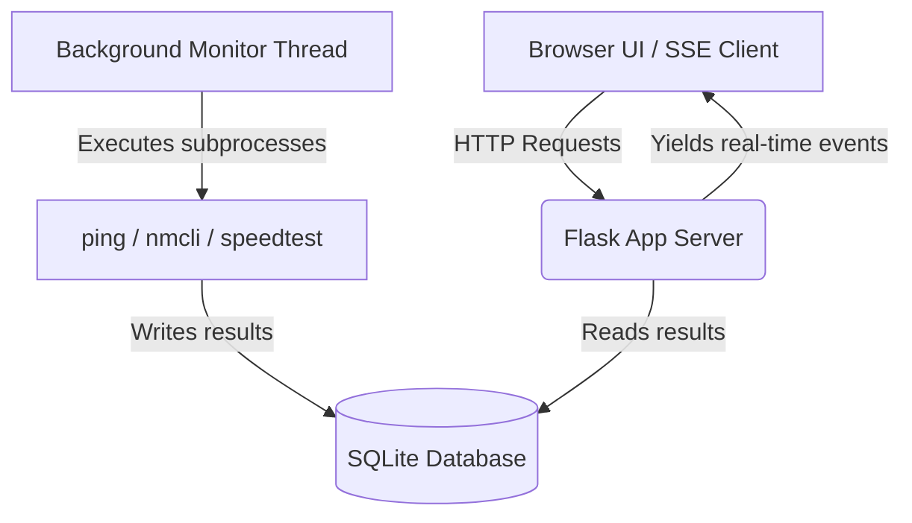

# Wi-Fi Monitor — Interview Preparation Guide

This guide is structured to help you present and defend this project in technical interviews. It translates the codebase architecture and engineering design choices into clear, high-impact talking points.

---

### Project Metadata
- **Project Name:** Wi-Fi Monitor — Live Network Dashboard
- **Problem Statement:** Traditional network diagnostics (like ad-hoc ping or browser speed tests) are manual, static, and fail to track network health over time. Furthermore, managing, scoring, and switching between crowded Wi-Fi channels is cumbersome for remote workers and power users needing stable connections.
- **Tech Stack:** Python (Flask, SQLite3), JavaScript (Vanilla ES6, Chart.js), HTML5/CSS3 (Monochromatic Dark UI), Linux network tools (`nmcli`, `ping`, `speedtest-cli`, `ip`).
- **My Role:** Full-Stack Developer & Network Architect
- **Target Users:** Remote developers, power users, and sysadmins requiring persistent connectivity diagnostics.
- **Output/Result:** A low-overhead, real-time background monitor with a 0–100 scored recommendation engine and a direct network connection flow.
- **Deployment Status:** Runs locally as a background `systemd` daemon managed by Gunicorn, with a host-mode Docker container for portable deployments.

---

## 1. Project Overview

### Simple Words
A web dashboard that monitors your internet health in the background. It periodically checks your connection quality (speed, delay, and drops) and scans nearby Wi-Fi networks. It scores and grades those networks (A+ to F) based on signal, band, speed, and security, and lets you connect to the best one directly from the dashboard.

### 30-Second Pitch
> "I built Wi-Fi Monitor, a lightweight network health portal. It solves the issue of sporadic drops by running a background daemon to continuously log latency (RTT) and packet loss to a local SQLite database. On the frontend, it uses Server-Sent Events (SSE) for low-latency dashboard updates. I also built a real-time Wi-Fi recommendation engine that parses local channel telemetry, grades nearby networks from A+ to F, and lets users connect to them directly using system-level network tools."

### 1-Minute Walkthrough
> "Most users only check their network quality after it has already failed. Wi-Fi Monitor operates continuously in the background, logging diagnostics without interrupting user activity. 
>
> The backend is written in Python/Flask, running periodic checks and interfacing with Linux utility binaries via sub-processes to run pings and stream `speedtest-cli` logs in real-time. The frontend is a vanilla JavaScript dashboard optimized for speed. It features a custom recommendation grid that scores nearby access points based on signal strength, channel frequency (2.4GHz vs 5GHz), security protocols, and link speeds. 
>
> Users get actionable optimization advice on hover, and can instantly transition connection profiles using an integrated password modal that communicates with the host's `nmcli` wrapper."

---

## 2. Problem and Use Case

### What it Solves
- **Invisible Packet Loss:** Catching transient dropouts that standard browser reload tests miss.
- **Wi-Fi Blindness:** Helping users choose the best access point when multiple SSIDs are visible but qualities vary.
- **Friction in Troubleshooting:** Eliminating the need to run CLI commands like `nmcli` or `ping` manually to diagnose connectivity.

### Real-Life Applications
- **Remote Work Optimization:** Assisting home workers in choosing the optimal room or connection channel.
- **Edge Devices/Raspberry Pi:** Acting as a localized diagnostic node on a network gateway.
- **Network Onboarding:** Providing non-technical users with a simple, data-backed scoring screen to pick the best network in a new office or workspace.

---

## 3. Why This Solution

### Architectural Choices
- **Monolithic Flask + SSE vs. React + Node + WebSockets:** 
  WebSockets require persistent two-way connections, introducing extra frame overhead. Server-Sent Events (SSE) use standard HTTP requests, are unidirectional, and auto-reconnect by default—perfect for streaming log data and metrics. 
- **Subprocess Integration vs. Python Networking Libraries:** 
  Interfacing directly with native Linux networking utilities (`nmcli`, `ping`, `ip`) ensures that the metrics collected match the actual operating system state exactly. Using native tools avoids the overhead and potential drift of third-party Python wrappers.

### Key Trade-offs
- **Linux Dependency:** To support direct Wi-Fi connections and scans, the system relies on `nmcli` (NetworkManager). It trade-offs cross-platform compatibility for deep OS integration.
- **SQLite Concurrency:** SQLite is chosen for its zero-configuration local footprint. The system handles SQLite's lack of high write-concurrency by serializing database operations on a single background worker thread.

---

## 4. System Architecture

### Data Pipeline Flow
1. **Input Phase:** The background scheduler triggers subprocess commands (`ping` and `nmcli`).
2. **Processing Phase:** The raw output strings are parsed, sanitized, and stored as structured rows in the SQLite database. Link quality scores (0-100) are generated dynamically.
3. **Output Phase:** Active browser sessions receive updates via a persistent SSE connection (`/api/stream`), updating UI indicators, charts, and recommendation cards.

---

## 5. Tech Stack Reasoning

- **Flask (Python):** Lightweight, easy to handle background threads, and supports native generator functions required for streaming SSE.
- **SQLite3:** Zero setup, file-based database. Perfect for edge/local deployments.
- **Vanilla CSS (Monochromatic Zinc):** Prevents third-party library bloating. It leverages a clean dark aesthetic similar to developer portals like Linear or Vercel, using a single accent (`#6366f1` Indigo) to direct focus.
- **Chart.js:** Renders canvas-based charts efficiently with low memory footprint, keeping CPU usage low on local machines.

---

## 6. Challenges and Learnings

### Challenge 1: Blocking Web Server during Long Speed Tests
- **Symptom:** Running a speedtest takes ~15 seconds. Spawning this in a standard request blocks the single-threaded Flask server from responding to other clients.
- **Solution:** Integrated background worker threads and used Python generator functions (`yield`) to stream the stdout buffer line-by-line using SSE. This keeps the web loop non-blocking and provides real-time UI metrics.

### Challenge 2: NetworkManager Scan Cache Latency
- **Symptom:** `nmcli device wifi list` often returns cached results, failing to show newly available networks.
- **Solution:** Implemented an on-demand trigger that explicitly requests a rescan (`nmcli device wifi rescan`) prior to fetching the scan results, ensuring up-to-date network quality listings.

---

## 7. Top 20 Interview Questions & Answers

### 1. How does the live speed test update the progress bar in real-time?
> "When the user triggers a speed test, the browser connects to an SSE endpoint (`/api/run/speedtest/stream`). The backend spawns the `speedtest-cli` binary in a subprocess, capturing its stdout. I read the stream line-by-line, parse progress percentages using regular expressions, format the values into JSON events, and immediately flush them down the open HTTP connection."

### 2. Why did you choose Server-Sent Events (SSE) over WebSockets?
> "WebSockets are bi-directional and require a custom protocol handshake, adding complexity and connection overhead. Our application only needs unidirectional, real-time updates from the server to the browser. SSE works over standard HTTP, has automatic reconnection built-in, and is extremely lightweight to implement with Flask generator functions."

### 3. How do you prevent database locks in SQLite when the background thread writes while the Flask app reads?
> "SQLite can throw `database is locked` errors during concurrent writes. To handle this, I configured the SQLite connection with a `timeout` parameter (usually 5–10 seconds) so concurrent queries wait. Additionally, write operations are strictly managed by a single background daemon thread, eliminating concurrent write conflicts."

### 4. How did you design the scoring algorithm for the Wi-Fi Recommendation Grid?
> "The engine calculates a score out of 100 based on weighted metrics:
> - **Signal Strength (50%):** Direct map of RSSI percentage.
> - **Frequency Band (20%):** +20 points for 5 GHz (faster, less congested), +10 for 2.4 GHz.
> - **Security (15%):** WPA3/WPA2 gets +15 points, older WPA gets +8, and open networks get 0.
> - **Link Rate (15%):** Scaled up to 15 points if the maximum throughput rate matches or exceeds 300 Mbps."

### 5. What security risks are associated with letting a web interface connect to Wi-Fi?
> "Exposing a connection API means arbitrary users could send connection requests. To secure this, the backend binds to `localhost` by default, restricting access to the local machine. In a production multi-user scenario, I would add session token validation and restrict the API endpoint using basic authentication."

### 6. How does your backend execute shell commands safely without shell injection vulnerabilities?
> "I avoid passing raw string commands to `os.system` or `subprocess.Popen` with `shell=True`. Instead, I pass commands as structured arrays (e.g., `['nmcli', 'device', 'wifi', 'connect', ssid, 'password', password]`). This bypasses the shell parser entirely, rendering command injection attacks impossible."

### 7. What happens if the network interface changes name (e.g., from `wlan0` to `wlp4s0`)?
> "The app uses `ip route` to locate the active default gateway interface dynamically. Rather than hardcoding network interface names, the backend queries the OS at startup, identifying which wireless interface is currently handling internet-bound traffic."

### 8. How did you structure the project files for clean separation of concerns?
> "The project is separated into two domains:
> 1. `wifi_monitor/` handles CLI arguments, SQLite operations, subprocess wrappers, and metric calculation.
> 2. `dashboard/` handles the Flask web server, API routing, and the static front-end code.
> This makes the core networking tools usable as standalone CLI utilities even if the web server is stopped."

### 9. Why didn't you use a CSS framework like Tailwind or Bootstrap?
> "To minimize page load times and dependency footprint, I chose to write clean, vanilla CSS. The layout uses modern CSS Grid and Flexbox, styled with a monochromatic dark theme. By defining custom CSS custom properties (variables), I maintained a cohesive style system without loading megabytes of external CSS assets."

### 10. How does the application handle a total internet outage?
> "If the ping tests to `8.8.8.8` fail, the backend logs a `FAILED` run in the database with 100% packet loss. The dashboard updates the 'Success Rate' metric accordingly, while the UI displays a clear warning badge without crashing the web app or background thread."

### 11. Can this tool be run on Windows or macOS?
> "The core dashboard and database logic are cross-platform, but the Wi-Fi scanning and connection features rely on Linux's `nmcli` and `ip` commands. To support Windows or macOS, we would need to implement platform-specific network command parsers (like `netsh` on Windows or `airport` on macOS)."

### 12. How do you handle password entry for Open (unsecured) networks?
> "The frontend checks the security string of the network card. If the security is 'Open', it skips the password modal entirely and immediately sends an empty password to the connection API, which executes `nmcli` without credentials."

### 13. How did you optimize the performance of Chart.js with high-frequency updates?
> "I set the chart animations to a short duration (400ms) and capped the data array sizes. Every time a new data point is received via the SSE stream, we push the new value, shift out the oldest value, and call `chart.update('none')` to skip unnecessary calculations."

### 14. What would happen if a user has multiple wireless network cards?
> "Currently, the default routing table dictates which interface is queried. If multiple active wireless cards exist, the dynamic gateway lookup picks the primary interface with the lowest metric. To handle complex configurations, we could add a dropdown in the UI allowing the user to select their preferred interface."

### 15. How do you package and run the application in a headless environment?
> "We provide a `systemd` service file template (`wifi-monitor.service`) and a deployment script. It configures the app to run as a background service managed by Gunicorn. The service automatically starts on system boot, routing logs to `journald`."

### 16. How does host networking mode help when containerizing this application with Docker?
> "In default bridge network mode, Docker isolates the container's network stack. The container cannot see the host's physical wireless interfaces or run `nmcli` commands. Using `network_mode: host` allows the containerized app to share the host's network namespace directly."

### 17. How do you test the background scheduling logic?
> "I wrote unit tests with `pytest` that mock the subprocess calls. By patching `subprocess.run` and `subprocess.Popen`, I can simulate various command outputs—like successful connections, wrong password errors, and timeout events—without modifying my local network state."

### 18. What is the CPU and memory footprint of the background daemon?
> "The daemon is extremely lightweight. The ping tests consume negligible CPU (less than 0.1% CPU spike every 5 minutes). The memory footprint is around 30-40MB, as it is a minimal Python process storing small string buffers."

### 19. How does the frontend handle SSE connection dropouts?
> "The browser's native `EventSource` API handles reconnections automatically. If the Flask server restarts, the browser continuously attempts to reconnect in the background. Once the server is online, the live stream resumes without requiring a page reload."

### 20. What is the next major feature you would add to this system?
> "I would add an **Automated Channel Optimization Advisor**. By analyzing the channel congestion maps we already build, the system could recommend the least crowded channel frequency (e.g., advising a channel switch from 6 to 11 on 2.4 GHz) and output the exact `nmcli` command to apply it."

---

## 8. Final Summary

> "Wi-Fi Monitor is a Linux-focused network health dashboard that automates connection quality analytics. It continuously monitors delay and loss using a background daemon, aggregates performance metrics in SQLite, and features a clean, monochromatic dashboard that grades nearby Wi-Fi networks in real-time. I designed it to be low-overhead and highly secure, utilizing direct OS-level calls rather than heavy external frameworks."
